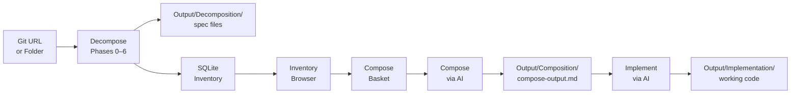

# OpenTransmute

> **Decompose any codebase. Accumulate its ideas. Compose new systems from them.**

**[Documentation](https://opentransmute.github.io/OpenTransmute/)**

OpenTransmute is a self-hosted tool that automates the process of turning an existing codebase into a language-agnostic specification, building a growing library of reusable algorithms, patterns, and abstractions, and then composing new system designs from that library. It ships as both a **local web app** and a **CLI** (`otx`).

---

## What is OpenTransmute?

Software is full of durable ideas — algorithms, design patterns, invariants, and abstractions — that outlive the language, framework, or organisation that first wrote them. OpenTransmute makes these ideas explicit and portable.

The workflow has three acts:

1. **Decompose** — Point OpenTransmute at a git repository or local folder. It runs a structured AI-driven analysis across eight phases, producing a set of Markdown specification documents in `Output/Decomposition/<project>/`. Phase 6 produces a *Composition Inventory* (a flat catalogue of every notable algorithm, pattern, abstraction, invariant, and domain concept), and Phase 7 produces an *Ethos & Style Fingerprint* (a standalone style guide derived directly from reading the codebase).

2. **Accumulate** — Each inventory is parsed and stored in a local SQLite database. Over time, as you decompose more codebases, the inventory grows into a cross-project library of reusable ideas. You can search, filter, and browse it on the **Inventory** screen.

3. **Compose** — Pick items from the inventory, add them to a basket, and run them through the *Compose* prompt. The AI synthesises new architectural designs, validates them for correctness and security, and produces hardened output. Alternatively, use **Transmute** to skip the basket entirely and re-implement a whole decomposed project directly.

4. **Implement** *(optional)* — Feed a compose or transmute output into the *Implement* pipeline. The AI generates a complete, working implementation from the spec.



---

## Prerequisites

- [.NET 10 SDK](https://dotnet.microsoft.com/download/dotnet/10.0)
- [`claude` CLI](https://docs.anthropic.com/claude/docs/claude-code) — installed and authenticated (required for the default Claude Agent backend)
- Git — for decomposing remote repositories

Verify your setup:
```bash
dotnet --version   # should print 10.x.x
claude --version   # should print claude CLI version
git --version
```

---

## Quick Start — Web App

```bash
git clone https://github.com/you/OpenTransmute
cd OpenTransmute/src/OpenTransmute
dotnet run
```

Open your browser at `http://localhost:5000`. The database is created automatically on first run at `DB/opentransmute.db` in the current directory.

---

## Quick Start — CLI (`otx`)

```bash
# Build and install globally
dotnet tool install --global --add-source ./src/OpenTransmute.Cli otx
# or run directly
dotnet run --project src/OpenTransmute.Cli -- --help
```

```
Usage: otx <command> [options]

Commands:
  decompose    Decompose a codebase into a language-agnostic specification
  compose      Compose a new system design from inventory items
  implement    Generate working code from a compose output spec file
  inventory    Browse inventory items extracted from decomposed projects
  jobs         List and inspect decompose and compose jobs
  settings     Show or update persisted CLI settings
```

The CLI shares the same SQLite database as the web app. Point both at the same working directory and they see the same inventory, projects, and job history.

---

## Decomposing a Codebase

### Via web app

1. Navigate to the **Decompose** screen (home page).
2. Paste a git URL (e.g. `https://github.com/org/repo`) or a local folder path.
3. The project name is inferred from the URL/folder — edit it if needed.
4. Choose an AI backend (see [AI Backends](#ai-backends) below). The default is **Claude Agent (CLI)**.
5. Leave **Start phase** at `0` for a fresh run, or enter a phase number to resume a previous run.
6. Click **Run**.

You are taken to the **Job Detail** screen, which shows:
- A horizontal phase stepper (phases 0–7) updating live as each phase completes
- A live log panel streaming the AI agent's output in real time
- Per-phase output previews, expandable to show the full text
- A **Re-run from phase N** button on each phase row — useful after a failure

### Via CLI

```bash
# Decompose a remote repository with Claude Code (default)
otx decompose https://github.com/org/repo

# Decompose a local folder with a custom project name
otx decompose ./my-project --project my-project

# Resume from phase 3 after a failure
otx decompose https://github.com/org/repo --project my-project --start-phase 3

# Run only phases 0–2
otx decompose https://github.com/org/repo --end-phase 2

# Use OpenAI with custom models
otx decompose https://github.com/org/repo \
  --orchestrator OpenAI \
  --api-key sk-... \
  --thick-model gpt-4o \
  --regular-model gpt-4o-mini \
  --thin-model gpt-4o-mini

# Use Ollama
otx decompose ./my-project \
  --orchestrator Ollama \
  --thick-model llama3.1:70b \
  --regular-model llama3.1:8b \
  --thin-model llama3.2:3b

# Inject domain hints into every phase prompt
otx decompose ./my-project \
  --hints "This codebase uses event sourcing with CQRS. The domain is financial trading."
```

**`otx decompose` options:**

| Option | Default | Description |
|---|---|---|
| `source` | *(required)* | Git URL or local folder path |
| `--project, -p` | auto-detected | Project name used in output paths |
| `--start-phase` | `0` | Phase to start from (0 = fresh run) |
| `--end-phase` | run all | Last phase to run, inclusive |
| `--orchestrator` | from settings | `ClaudeCode` \| `OpenAI` \| `Ollama` |
| `--api-key` | `OPENAI_API_KEY` env | OpenAI API key |
| `--endpoint` | from settings | Custom OpenAI-compatible base URL |
| `--thick-model` | from settings | Model for heavy phases |
| `--regular-model` | from settings | Model for normal phases |
| `--thin-model` | from settings | Model for light phases |
| `--max-turns` | from settings | Max agent turns per phase |
| `--max-tokens` | from settings | Max output tokens per call (0 = auto) |
| `--keep-clone` | `false` | Keep the cloned repo after completion |
| `--hints` | *(none)* | Free-text domain knowledge injected into every phase prompt |

### What each phase produces

| File | Phase | Contents |
|---|---|---|
| `00-index.md` | 0 — Index | Architectural overview, key design decisions |
| `01-structural-survey.md` | 1 — Structure | Directory tree, entry points, config files, dependencies |
| `02-initialization-flow.md` | 2 — Init flow | Startup sequence, hooks, shutdown, async tasks |
| `03-01-*.md` … `03-N-*.md` | 3 — Components | Full spec for each logical subsystem cluster |
| `04-data-formats.md` | 4 — Data formats | File formats, protocols, public API surfaces |
| `05-reimplementation-checklist.md` | 5 — Checklist | Ordered re-implementation guide with acceptance criteria |
| `06-composition-inventory.md` | 6 — Inventory | Flat catalogue of algorithms, patterns, abstractions |
| `07-ethos.md` | 7 — Ethos | Style fingerprint: naming, error handling, abstraction discipline, logging, concurrency, config, dependency style, docs, test philosophy, overall character |

All files are saved to `Output/Decomposition/<project-name>/` relative to the working directory.

Phase 7 produces a standalone style guide derived entirely from reading the real codebase. Every claim is grounded in a concrete example from the source. Where practices diverge from widely-accepted conventions (language idioms, SOLID, OWASP, community style guides), Phase 7 flags the divergence and notes whether it appears deliberate — so that a Compose run can make an informed choice about whether to replicate or correct it.

### Domain hints

Use `--hints` (CLI) or the **Hints** field in the web app to surface domain knowledge the AI would not discover on its own:

```bash
otx decompose ./trading-engine \
  --hints "Uses event sourcing with CQRS. The Saga pattern coordinates multi-step trades. \
           Idempotency keys prevent double-execution on retries."
```

Hints are injected verbatim into every phase prompt. Keep them factual and concise.

---

## The Composition Inventory

After Phase 6 completes, the `06-composition-inventory.md` file is automatically parsed and its contents stored in the local SQLite database. The inventory is organised into seven categories:

| Category | What it captures |
|---|---|
| **Algorithm** | Name, purpose, inputs/outputs, time and space complexity, pseudocode |
| **Design Pattern** | Pattern name, where applied, problem solved, deviations from canonical form |
| **Invariant** | The condition, when it must hold, what breaks if violated |
| **Data Transformation** | Input shape, output shape, transformation logic, where it occurs |
| **Domain Vocabulary** | Term, definition as used in this system, why it matters |
| **Architectural Primitive** | The smallest indivisible building block; what it is, what is built on top of it |
| **Key Abstraction** | What it hides, what it exposes, what breaks if it leaks |

### Browsing the inventory

**Via web app** — Open the **Inventory** screen to:
- Filter by category and/or source project
- Full-text search across name and summary
- Expand any row to see all structured fields and the original raw markdown
- Add items to the **Compose basket**
- Export the current filtered view to JSON

**Via CLI:**
```bash
# List all items
otx inventory

# Filter by category
otx inventory --category Algorithm

# Filter by project
otx inventory --project my-project

# Search by name or summary
otx inventory --search "retry"

# Show full markdown for each result
otx inventory --search "retry" --verbose
```

**`otx inventory` options:**

| Option | Description |
|---|---|
| `--search, -s` | Filter by name or summary (case-insensitive contains) |
| `--category, -c` | Filter by category (Algorithm, DesignPattern, Invariant, …) |
| `--project, -p` | Filter by project name |
| `--verbose, -v` | Show the raw markdown block for each item |

---

## Composing New Systems

### Via web app

1. On the **Inventory** screen, click **Add to basket** on any items you want to use.
2. Navigate to the **Compose** screen.
3. Review your basket — remove items or toggle grouping by category.
4. Expand the **Prompt Preview** panel to see the exact prompt that will be sent to the AI.
5. Choose a backend and click **Run Compose**.

Results are saved to `Output/Composition/<name>/compose-output.md`.

### Via CLI

```bash
# Compose from specific items (by name or GUID)
otx compose --output my-new-system \
  --items "Token Bucket Rate Limiter,Circuit Breaker Pattern" \
  --description "A resilient API gateway" \
  --technology "Go, gRPC" \
  --environment "Kubernetes"

# Include all items from a category
otx compose --output algorithms-demo --category Algorithm --output demo

# Include all items from a project
otx compose --output my-new-system --project trading-engine --output system-v2

# Combine item selection methods
otx compose --output my-new-system \
  --project trading-engine \
  --category Algorithm \
  --items "some-extra-item-guid"

# Pass a per-run coding ethos
otx compose --output my-new-system --items "..." \
  --ethos "All public APIs must have OpenAPI annotations. Errors use RFC 7807 problem details."
```

**`otx compose` options:**

| Option | Default | Description |
|---|---|---|
| `--output, -o` | *(required)* | Output name (used in file path and job header) |
| `--items, -i` | | Comma-separated item IDs (GUID) or exact names |
| `--category, -c` | | Include all items in this category |
| `--project, -p` | | Include all items from this project |
| `--description` | | What the target system should be and do |
| `--environment` | | Where it runs (cloud, browser, embedded, …) |
| `--technology` | | Tech stack / language / framework |
| `--orchestrator` | from settings | `ClaudeCode` \| `OpenAI` \| `Ollama` |
| `--api-key` | `OPENAI_API_KEY` env | OpenAI API key |
| `--endpoint` | from settings | Custom OpenAI-compatible base URL |
| `--model` | from settings | Model override |
| `--max-tokens` | 8192 | Max output tokens |
| `--timeout` | from settings | HTTP timeout in minutes |
| `--ethos` | from settings | Coding style / standards injected as a top-level instruction |

At least one of `--items`, `--category`, or `--project` is required.

### User ethos

The *user ethos* is a free-form block of text describing your personal coding standards — naming conventions, error handling philosophy, testing requirements, security baselines, etc. It is injected into every Compose run as a top-level authoritative instruction.

Set it once in settings so it applies to every future compose run:

```bash
otx settings --user-ethos "All code must be idiomatic Go. Errors are wrapped with fmt.Errorf and %w. \
  All exported functions have godoc comments. No global state."
```

Override it for a single run with `--ethos` on the compose command. Pass an empty string to the settings command to clear it:

```bash
otx settings --user-ethos ""   # clears the saved ethos
```

---

## Transmuting a Project

Transmute is a shortcut that takes a previously-decomposed project and re-implements it directly — without going through the inventory basket. Instead of selecting individual items, the entire decomposition output (phases 01–06) is assembled into a single prompt and fed straight into the Compose engine.

Use Transmute when you want to re-implement a whole project in a different language or framework and don't need to cherry-pick individual ideas from the inventory first.

### How it differs from Compose

| | Compose | Transmute |
|---|---|---|
| Input | Individual inventory items selected from any project(s) | All phase outputs from one decomposed project |
| Selection | Manual basket (pick what you want) | Automatic (whole spec) |
| Cross-project mixing | Yes | No |
| Good for | Synthesising new designs from reusable ideas | Re-implementing an existing project in a new stack |

### Via web app

1. Navigate to the **Transmute** screen, or click the **Transmute** button on any project card in the **Projects** screen.
2. Select the source project (pre-filled if coming from Projects).
3. Enter a target re-implementation description — e.g. `"Re-implement in Rust using Axum and Tokio"`.
4. Choose a backend and click **Run Transmute**.

The job runs through the same Compose pipeline and its output is saved to `Output/Composition/<name>/compose-output.md`. The user ethos setting (if configured) is injected as a top-level instruction, same as a normal Compose run.

---

## Implementing a Spec

The `implement` command takes a compose output file and drives the AI to write a complete working implementation.

```bash
# Implement from a compose output file
otx implement Output/Composition/my-new-system/compose-output.md \
  --project my-new-system \
  --output ./generated/my-new-system

# With a specific model (defaults to thick model for maximum capability)
otx implement path/to/spec.md \
  --orchestrator OpenAI \
  --api-key sk-... \
  --model gpt-4o \
  --max-turns 300 \
  --timeout 90
```

**`otx implement` options:**

| Option | Default | Description |
|---|---|---|
| `spec` | *(required)* | Path to the compose output spec file |
| `--output, -o` | `Output/Implementation/<project>` | Output directory for generated code |
| `--project, -p` | inferred from spec path | Project name |
| `--orchestrator` | from settings | `ClaudeCode` \| `OpenAI` \| `Ollama` |
| `--api-key` | `OPENAI_API_KEY` env | OpenAI API key |
| `--endpoint` | from settings | Custom OpenAI-compatible base URL |
| `--model` | thick model from settings | Model override |
| `--max-turns` | `200` | Max agent turns |
| `--timeout` | `60` | HTTP timeout in minutes |

---

## CLI Settings

Use `otx settings` to view and update persisted defaults. Settings are stored in `~/.opentransmute/settings.json` and apply to all future CLI runs unless overridden per-command.

```bash
# Show current settings
otx settings

# Set default orchestrator to OpenAI with models
otx settings \
  --orchestrator OpenAI \
  --thick-model gpt-4o \
  --regular-model gpt-4o-mini \
  --thin-model gpt-4o-mini

# Set a custom endpoint (Azure, LM Studio, etc.)
otx settings --endpoint https://my-resource.openai.azure.com/...

# Set defaults for token and turn limits
otx settings --max-turns 30 --max-tokens 0 --timeout 15

# Set a persistent user ethos for all compose runs
otx settings --user-ethos "Prefer immutable data structures. All errors are typed. 100% test coverage."

# Clear the user ethos
otx settings --user-ethos ""
```

**`otx settings` options:**

| Option | Description |
|---|---|
| `--orchestrator` | Default engine (`ClaudeCode` \| `OpenAI` \| `Ollama`) |
| `--endpoint` | Default OpenAI-compatible base URL |
| `--thick-model` | Default model for heavy phases |
| `--regular-model` | Default model for normal phases |
| `--thin-model` | Default model for light phases |
| `--max-turns` | Default max agent turns per phase |
| `--max-tokens` | Default max output tokens (0 = auto) |
| `--timeout` | Default HTTP timeout in minutes |
| `--user-ethos` | Personal coding standards injected into every Compose run |

API keys are **never saved to disk**. Pass `--api-key` on each command or set the `OPENAI_API_KEY` environment variable.

---

## Inspecting Jobs

```bash
# List all jobs (both decompose and compose)
otx jobs

# Filter by type
otx jobs --type decompose
otx jobs --type compose

# Show full detail for a specific job
otx jobs --id <guid>
```

---

## AI Backends

| Backend | Description |
|---|---|
| **ClaudeCode** | Invokes the `claude` CLI as a subprocess. The agent uses its own file-reading tools to explore the source directory — no manual file packing required. Requires `claude` CLI installed and authenticated. Auto-maps weight tiers to Opus / Sonnet / Haiku. |
| **OpenAI** | Calls any OpenAI-compatible HTTP API. Works with OpenAI, Azure AI Foundry, LM Studio, vLLM, and others. Requires a base URL and API key. |
| **Ollama** | Calls a local Ollama instance via its OpenAI-compatible API (`http://localhost:11434`). Requires Ollama running locally with your chosen models pulled. |

### Setting up the Claude Agent backend

```bash
# Install Claude Code CLI
npm install -g @anthropic-ai/claude-code

# Authenticate
claude login
```

No further configuration is required. Model weight tiers are automatically mapped:
- Thick phases → Claude Opus
- Normal phases → Claude Sonnet
- Thin phases → Claude Haiku

### Setting up the OpenAI-compatible backend

Provide the base URL and API key in the backend configuration fields on the job submission form, or via CLI flags / `otx settings`:

| Provider | Base URL |
|---|---|
| OpenAI | `https://api.openai.com/v1` |
| Azure AI Foundry | `https://<resource>.openai.azure.com/openai/deployments/<deployment>` |
| LM Studio (local) | `http://localhost:1234/v1` |

### Setting up the Ollama backend

Install Ollama and pull models for each weight tier:

```bash
ollama pull <your-thick-model>
ollama pull <your-regular-model>
ollama pull <your-thin-model>
```

Configure the model names via `otx settings` or the backend fields in the web app.

---

## Output File Reference

| Path | Contents |
|---|---|
| `Output/Decomposition/<project>/00-index.md` | Architecture overview and key design decisions |
| `Output/Decomposition/<project>/01-structural-survey.md` | Full structural survey |
| `Output/Decomposition/<project>/02-initialization-flow.md` | Startup and runtime flow |
| `Output/Decomposition/<project>/03-NN-<name>.md` | Component specification (one per cluster) |
| `Output/Decomposition/<project>/04-data-formats.md` | Data formats and protocols |
| `Output/Decomposition/<project>/05-reimplementation-checklist.md` | Re-implementation checklist |
| `Output/Decomposition/<project>/06-composition-inventory.md` | Composition inventory (source for DB import) |
| `Output/Decomposition/<project>/07-ethos.md` | Style fingerprint and coding standards guide |
| `Output/Decomposition/<project>/inventory.json` | Per-project inventory export |
| `Output/Decomposition/<project>/job.json` | Job state (used for resume-on-failure) |
| `Output/Composition/<name>/compose-output.md` | Compose run output |
| `Output/Implementation/<project>/` | Implemented code files |
| `DB/opentransmute.db` | SQLite database (projects + inventory items) |

---

## Resuming a Failed Run

If a decompose job fails mid-run (network error, rate limit, agent crash):

**Via web app:**
1. Go to **Job History** and click the failed job.
2. Each phase row has a **Re-run from phase N** button.
3. Clicking it creates a new job with `startPhase = N`. All outputs from phases 0 through N−1 are reloaded from disk automatically.

**Via CLI:**
```bash
otx decompose https://github.com/org/repo --project my-project --start-phase 3
```

Phase state is persisted to `Output/Decomposition/<project>/job.json` after every phase completion, so you never lose progress from a completed phase.

---

## Exporting the Inventory

**Via web app** — On the **Inventory** screen, click **Export current view** to download a JSON file of the currently filtered/searched results.

**Via API:**
```
GET /api/inventory/export?projectId=<guid>   # export one project
GET /api/inventory/export                     # export all projects
```

The export format is:
```json
{
  "project": { "name": "...", "source": "...", "decomposedAt": "..." },
  "items": [
    {
      "id": "...",
      "category": "Algorithm",
      "name": "...",
      "summary": "...",
      "details": { "inputs": "...", "outputs": "...", "pseudocode": "..." },
      "rawMarkdown": "..."
    }
  ]
}
```

---

## Prompts Reference

OpenTransmute embeds prompt files as resources in the `OpenTransmute.Core` assembly:

| File | Purpose |
|---|---|
| `src/OpenTransmute.Core/Prompts/decompose.md` | Eight-phase codebase mapping prompt system. Drives phases 0–7. |
| `src/OpenTransmute.Core/Prompts/compose.md` | Composition and validation prompt. Used by the Compose pipeline. |
| `src/OpenTransmute.Core/Prompts/transmute.md` | Standing guards prepended to every Transmute and Implement prompt. |

All files are embedded as resources at build time. To customise a prompt, edit the `.md` file and rebuild:

```bash
cd src/OpenTransmute.Core
dotnet build
```

The prompts use `<project>`, `<path>`, and `<ListItem.X>` (for expansion phases, where `X` is a field name such as `groupName` or `files`) as substitution tokens. These are resolved at runtime by `PromptBuilder` in `OpenTransmute.Parsing`.

Phase 3 is an *expansion phase*: a discovery prompt first asks the AI to return a JSON list of clusters, then a template prompt is run once per cluster with `<ListItem.groupName>` and `<ListItem.files>` substituted. This is detected automatically from the `## Phase 3` section in `decompose.md` via the `**Expansion Discovery:**` marker.

---

## Contributing & Extending

### Adding a new AI backend (`ILlmExecutor`)

`ILlmExecutor` in `OpenTransmute.Llm` is the single abstraction used by all pipelines (Decompose, Compose, Implement, and Transmute). The `JobOrchestrator` selects the executor at runtime by matching `OrchestratorType`.

1. Create a class in `src/OpenTransmute.Core/Llm/` that implements `ILlmExecutor`:
   ```csharp
   public class MyExecutor : ILlmExecutor
   {
       public OrchestratorType BackendType => OrchestratorType.OpenAI; // reuse or extend the enum

       public async IAsyncEnumerable<LlmOutputEvent> ExecuteAsync(
           LlmExecutionContext ctx, CancellationToken ct)
       {
           // yield LlmLine events, then LlmCompleted or LlmFailed
       }
   }
   ```
2. Register it in `ServiceRegistration.cs` inside `AddOpenTransmuteCore`:
   ```csharp
   services.AddSingleton<ILlmExecutor, MyExecutor>();
   ```
3. Add a selection option for it in `Components/Pages/Decompose.razor` (web app) and/or the relevant CLI command.

Deliver failures as `LlmFailed` events rather than throwing — the retry logic in `OpenTransmute.Retry` intercepts these and applies backoff for rate limits and context-reduction for context overflow.

### Adding a new inventory category

1. Add a value to `Models/InventoryCategory.cs` in `OpenTransmute.Core`.
2. Create `Inventory/SectionParsers/MyNewSectionParser.cs` implementing `ISectionParser`.
3. Register it in `Inventory/InventoryParser.cs`.
4. Add a new EF Core migration: `dotnet ef migrations add AddMyNewCategory`
5. Define the `DetailsJson` shape in the data model documentation.

### Adding a new decompose phase

Phases are data-driven — no code class is required. Add a new `## Phase N — Title` section to `src/OpenTransmute.Core/Prompts/decompose.md` following the existing conventions:

- `**Goal:**` — description of what the phase produces
- `**Model Weight:**` — `thick`, `normal`, or `thin`
- `**Prior Context:**` — comma-separated list of phase numbers whose outputs to inject, or `none`
- A fenced code block containing the prompt text

For expansion phases (like Phase 3), also include:
- `**Expansion Discovery:**` — expansion type (`clusters` or similar)
- `**Expansion Output Pattern:**` — glob pattern for output files (e.g. `03-*-*.md`)
- A second fenced code block containing the per-item template prompt

---

## Licence

MIT
