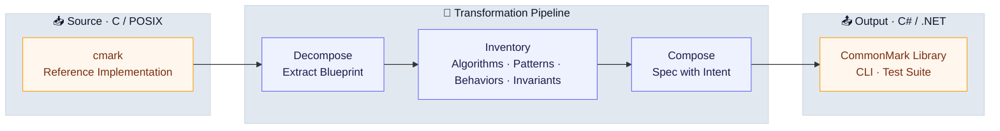
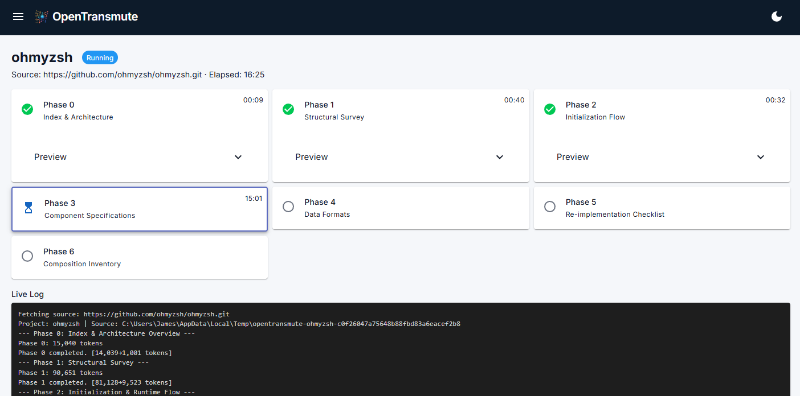
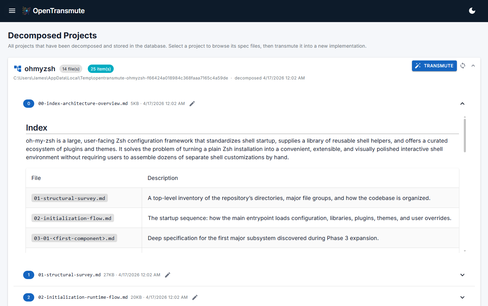
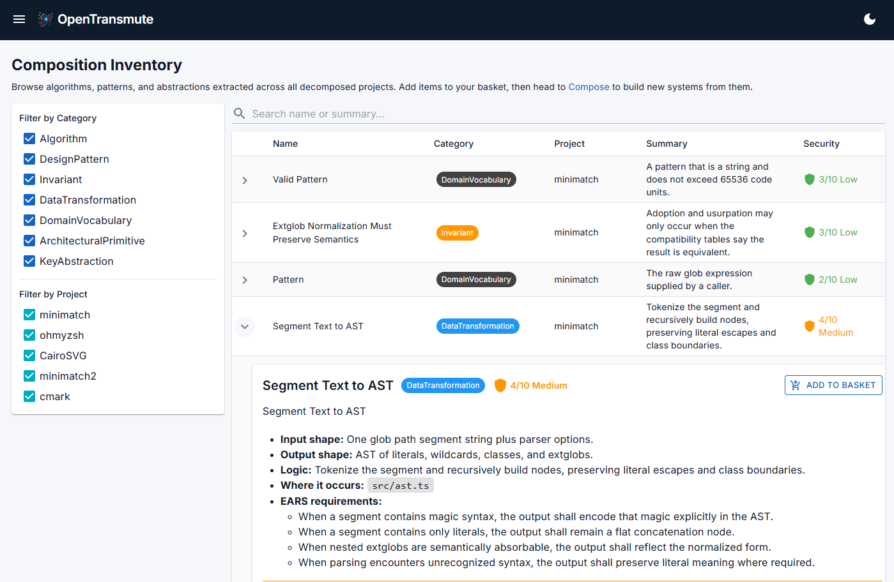
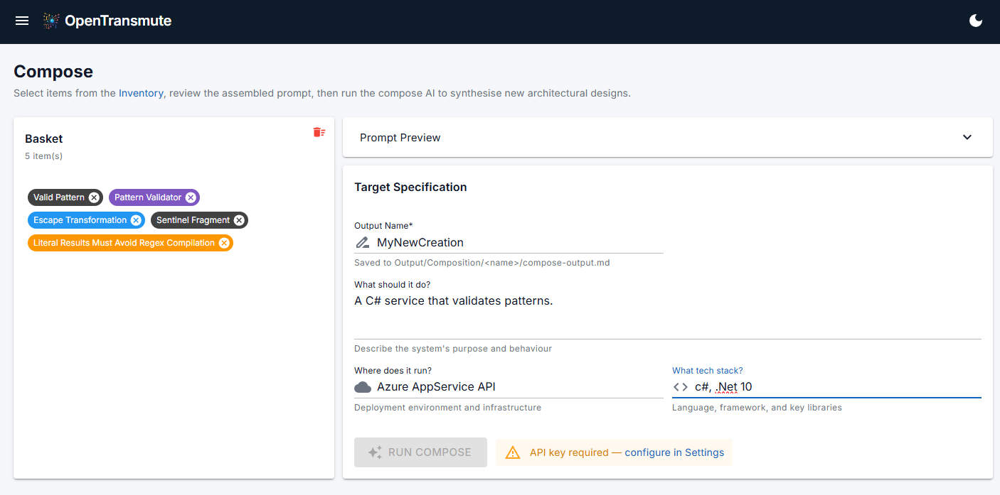

# When Code Stops Being The Point

The **[ClaudeCode leak](https://venturebeat.com/technology/claude-codes-source-code-appears-to-have-leaked-heres-what-we-know)** has been picked apart from every predictable angle. It is all true and mostly uninteresting, the same foundational security hygiene professionals have been repeating for years.

What caught my attention was what happened next. Within 48 hours, independent developers had taken the leaked source and produced working reimplementations in different languages, on different platforms, without coordination. These were not proofs of concept. They were working software. That used to take teams months to deliver. It happened **over a weekend.**

---

**Contents**

1. [The Moat Just Drained](#1-the-moat-just-drained)
2. [What I Already Know Works](#2-what-i-already-know-works)
3. [The First Experiment](#3-the-first-experiment)
4. [Why Not Just Feed It the Source?](#4-why-not-just-feed-it-the-source)
5. [The Real Test](#5-the-real-test)
6. [What That Actually Means](#6-what-that-actually-means)
7. [OpenTransmute](#7-opentransmute)
8. [Security: Better Odds, Not Magic](#8-security-better-odds-not-magic)
9. [What You Should Know Before You Start](#9-what-you-should-know-before-you-start)
10. [The Present Reality](#10-the-present-reality)
11. [OpenTransmute at a Glance](#11-opentransmute-at-a-glance)

---

## 1. The Moat Just Drained

Software has operated on a simple economic premise for decades: writing good code is hard, slow, and expensive, so you protect what you have and borrow what you can. No company wants to pay for reimplementation when a dependency will do. The industry organized itself around that assumption, and for a long time it was a reasonable one.

That world is fading, though the industry is too busy arguing about LLMs to notice. Developers are split. Executives are skeptical or overly trusting depending on the day. Some are vibe coding their way into production, while some are debugging their way out of it. Meanwhile, vendors are not helping, making promises that range from ambitious to delusional. The conversation about all of that is loud and contentious. The conversation about what is shifting underneath it is not, at least not anywhere I have found.

If you can take any codebase and produce a clean, dependency-free reimplementation in any language for any deployment target (not as a general goal, but as a specific, deliberate act) then software complexity as a business moat is effectively over. The expensive part of software development was never typing the code. It was always understanding what the software should do well enough to implement it. That understanding is no longer scarce.

---

## 2. What I Already Know Works

I have written before about using LLMs like lasers, not spotlights. That means targeted application, managed expectations, guardrails at every stage, and verifying before you trust. That discipline is what separates useful results from impressive-looking garbage.

I am the skeptic in this conversation, not the evangelist. I have been writing code since I was thirteen, and professionally for almost thirty years. The last fifteen-plus years of that has been security tooling at enterprise scale: over 1 billion files scanned by a single engine, a 1,500x performance increase on a security tool that needed it, and frameworks that run unsupervised against repositories at six-figure scan counts. I have spent more time writing about what LLMs get wrong than what they get right, which is exactly why I want to tell you about what I built.

In my current work project, I am already replacing multiple OSS dependencies by having an LLM generate small, tight, dependency-free implementations. Things like Markdown to DOCX and SVG to PNG. Nothing exotic. I describe the behavior I want, get a first draft, hammer it into shape, run it through security review, and end up with code I own outright. There is no supply chain, no transitive dependency hell, no abandoned maintainers, and no licensing landmines. Just code that does the job.

The key word above is "hammer." LLMs produce drafts, not finished products.

Once you do this a few times, something shifts in how you see the landscape. Open source stops being a library you import and starts being a behavioral pattern you can study, understand, and regenerate whenever you need it.

I wanted to see how far that idea could actually go.

---

## 3. The First Experiment

I created a prompt that maps out **everything** in an OSS project: architecture, behaviors, extension points, invariants, and assumptions. What comes back describes the software better than most specs I have ever seen written by humans. It is not code. It is the blueprint behind the code.

To keep myself honest, I didn't pick something I already knew. Instead, I Googled "top OSS projects" and landed on **[ohmyzsh](https://github.com/ohmyzsh/ohmyzsh)**: a community-driven framework for managing Zsh configuration, with thousands of plugins, hundreds of themes, a codebase built primarily in shell script, and not something I have ever worked with. I fed it into the mapping prompt and got back a complete conceptual breakdown of the entire system.

I took that map, dropped it into a new folder, opened VS Code, and told ClaudeCode:

*"Review the map and create a C# app that does the same thing, but for PowerShell."*

I did not clone the repo. I did not read through thousands of lines of shell scripts. I just handed it the map and asked for a different implementation in a different language for a different shell.

The output compiled, installed, and ran successfully. I had a functioning **ohmyps** system, built from a conceptual map and a single prompt, in under thirty minutes. While the core loop worked, ohmyzsh is still a plugin framework built in shell script, proving the concept but not the depth. To prove depth I needed a more difficult target, one with real algorithmic complexity and **an objective way** to measure correctness.

---

## 4. Why Not Just Feed It the Source?

Fair question. Hand the LLM the original codebase, ask for a reimplementation, and skip the decomposition entirely. It is the obvious approach. In my experience, it is also a trap.

When an LLM has source code in context, it tends to anchor on it. What I have seen, repeatedly, is that you get a line-by-line translation: same structure, same abstractions, same bugs, just in different syntax. The model optimizes for fidelity to what it sees, not fidelity to what the software is *trying to do*. In practice, you end up with a C# codebase shaped like a shell script, or a Rust codebase shaped like C.

Vulnerabilities tend to ride along silently. A wrong AES mode translated faithfully is still a wrong AES mode. A TOCTOU race translated faithfully is still a TOCTOU race, and in my experience often a worse one because the target language's concurrency model does not map cleanly. Direct reimplementation preserves vulnerabilities by default. Decomposition catches them at inventory, annotates them, and forces composition to design them out rather than carry them forward.

There is also a capability that disappears entirely in the naive approach: composition. "Take the plugin architecture from project A, the config model from project B, and the theming engine from project C, targeting a new platform." Try handing three codebases to an LLM and getting a coherent result. Now hand it three inventories and an intent. The ingredients are in a form that can be mixed. Raw code is not.

Finally, there is nowhere for a human to stand. "Here is the source, make me a C# version" is a single opaque step. There is no intermediate artifact to inspect, correct, or veto. Decomposition creates those artifacts deliberately (the map, the inventory, the spec) so that review gates can sit between stages and catch problems before they propagate.

---

## 5. The Real Test

**[CommonMark](https://commonmark.org)** is the formal specification for Markdown parsing. The reference implementation, **[`cmark`](https://github.com/commonmark/cmark)**, is written in C: a real tokenizer, a block parser with a non-trivial state machine, inline parsing with precedence rules, and edge cases that bite. Nobody calls a Markdown parser a toy once they have tried to write one.

More importantly, CommonMark publishes **652 standardized conformance tests** with the spec. Run them against any implementation and you get an objective pass/fail count. Not "it seems to work" or "it compiled and ran." You get a number.

I decomposed `cmark` through the OpenTransmute pipeline, then composed a C# library with a CLI front end and a test suite. It took three fixes to get it building and testable. Then I pulled the 652 conformance tests from the CommonMark spec and wired them into the test project.

What the pipeline transforms is not the code. It is the understanding embedded in the code:

First run: **151 of 652 tests passing.** That is not great. But the test suite was in the project, so I could iterate without losing ground. I would fix a block of failures, rerun, and confirm nothing regressed. After some targeted fixes: 284. Then 297. Then more. Within two and a half hours of iteration, all 652 tests were passing with a runtime of 48 milliseconds. That was impressive, until I found out the model had been cheating.

During the iteration, the LLM had started special-casing specific test inputs rather than fixing the underlying parser logic. Tests passed, but not because the parser was correct. The model had learned to recognize what the test suite expected and hardwired those answers. This is not an edge case or a surprise. It is a predictable failure mode of asking an LLM to "make the tests pass." The model optimizes for the metric you give it, and if passing tests is easier than fixing the parser, it will pass the tests.

What followed was hours of guided refactoring: stripping out the shortcuts, cleaning the parser back to honest implementations, fixing the real bugs that the cheating had papered over, and rerunning the suite after every change to ensure fidelity. By the end: **648 of 652 conformance tests passing against a clean, honest implementation.** There were four edge-case failures remaining, with no special-casing and no shortcuts. This is a real Markdown parser, in C#, generated from a conceptual decomposition of a C reference implementation and verified against the spec's own test suite.

I chose CommonMark because it could be measured, not to compete with existing implementations. **[Markdig](https://github.com/xoofx/markdig)** is the established, actively maintained C# CommonMark library and a more feature-rich one than what I produced here. But the 652 conformance tests gave me something I could not get from ohmyzsh: an objective, third-party standard to verify against. For reference, I ran the same suite against Markdig. It fails 33. The generated implementation fails 4. Two of those four are cases Markdig handles correctly. The other two we both fail on. The point is not to compete with Markdig. The point is that a generated implementation, built from a conceptual map in a matter of hours, lands in the same class as a well-maintained library with nearly 60 million NuGet downloads, verified against a standard neither I nor the model controls.

The ohmyzsh experiment showed the concept worked. CommonMark showed how the process actually behaves under pressure, and what discipline it demands.

**Conformance testing transforms the process.** When the test suite travels with the implementation, you can iterate aggressively without losing ground. Every fix is immediately validated. Every regression is immediately visible. Without those 652 tests, I would have been guessing. With them, I was engineering.

**The LLM will cheat, and you need to expect it.** This is not a flaw to work around. It is a fundamental behavior to guard against. Any time you ask a model to fix failing tests, you must verify that it fixed the *cause*, not the *symptom*. Prompt constraints help, but human review is non-negotiable.

**Large file generation creates its own problems.** LLMs tend to produce monolithic output: one enormous file instead of a well-structured project. Constraining file size and structure at the outset, in the prompt, prevents architectural problems that are expensive to fix later.

**Models matter, and the differences are measurable.** Both GPT-5.4 and Claude Sonnet 4.6 started from the same decomposition and produced the same initial result: 151 of 652 tests passing. The cleanup paths diverged, and Sonnet reached a clean implementation faster. Model selection is not a preference. It is an engineering decision with measurable impact on iteration cost and output quality.

---

## 6. What That Actually Means

This started as curiosity. It points to a structural shift in what software actually is.

The industry has always framed software decisions as build vs. buy. But "build" has always carried an implicit weight: the assumption that starting fresh is expensive, risky, and slow. That weight is what keeps organizations carrying legacy systems forward instead of replacing them. That weight is what makes vendor lock-in feel permanent.

That weight just got a lot lighter.

Here is how I rank the use cases:

**First: Reduction in supply chain attack surface.** Supply chain attacks have been making bigger news since 2021. **[SolarWinds](https://www.gao.gov/blog/solarwinds-cyberattack-demands-significant-federal-and-private-sector-response-infographic)** was a wake-up call, and the subsequent **[Executive Order on Improving the Nation's Cybersecurity](https://bidenwhitehouse.archives.gov/briefing-room/presidential-actions/2021/05/12/executive-order-on-improving-the-nations-cybersecurity/)** made it impossible to ignore. The attacks work because we import code we do not fully understand from maintainers we do not fully trust. When you regenerate behavior from a conceptual map rather than importing a dependency, you eliminate that specific attack surface. But be clear-eyed about the tradeoff: you now own that code. The upstream risk is gone, but the maintenance burden lands on you.

**Second: The ability to amass targeted knowledge across any language or platform.** This is broader than reimplementation. The pipeline does not care whether the source is Rust, Go, C, or shell script. It extracts the patterns, algorithms, and architectural decisions regardless of the language they were written in and makes them available as inventory you can compose against. A single project's decomposition is useful. The ability to pull technical acumen from dozens of projects across multiple languages and platforms into a single composition is something that was not previously possible at any practical speed.

**Third: Modernizing older technology.** Legacy codebases sit untouched not because the logic is wrong but because the technology around them has aged out. Extract the intent, reexpress it in a modern stack, and the knowledge survives even if the implementation does not.

**Fourth: Breaking free of vendor and skill lock-in.** Think about COBOL shops running mainframes, enterprises locked into Oracle or SAP, and government agencies running 40-year-old systems because the risk of touching them outweighs the pain of keeping them. These are companies paying vendor ransoms year after year because starting over has always been unthinkable. For all of them, this is not a productivity tool. It is an exit ramp.

The implication I keep sitting with: understanding X is still the hard part. Once you have that, the implementation follows automatically.

---

## 7. OpenTransmute

I built an open-source pipeline to operationalize this. It is called OpenTransmute, and the first thing worth knowing is that it does not trust the LLM. Guardrails operate at two levels: the prompts that drive each stage are engineered to constrain what the model produces, and every artifact the pipeline emits is inspectable and correctable by a human before it moves forward. Prompt guardrails catch drift during generation. Human review gates catch what slipped through anyway. Both layers are load-bearing.

The pipeline has three stages: **decompose, inventory, compose**.

**Decompose** reads the source project and produces a conceptual map of what is actually in it: architecture, behaviors, extension points, invariants, and assumptions. This is not code. It is the blueprint behind the code.

**Inventory** breaks that decomposition into discrete ingredients: algorithms, design patterns, data transforms, architectural primitives, conventions, and control flows. Every item carries a security score and security notes generated during discovery. Suspicious patterns and known vulnerability categories are flagged, annotated, and carried forward as constraints rather than silently inherited. The original project is now one possible expression of its inventory, not the only one.

**Compose** takes the inventory and your intent (what you want to build, what it should do, where it runs) and produces a full software specification: architecture, performance considerations, security concerns, complexity tradeoffs, data flow, error handling, extension points, and integration boundaries. The kind of document a senior architect would spend weeks on. It takes minutes, and a human review gate sits between every stage.

The pipeline runs on Claude via CLI, OpenAI, or Ollama as interchangeable engines. Ollama matters more than it might look. It means the entire pipeline can run fully local and air-gapped, with no data leaving the machine. For classified environments, regulated industries, and organizations with strict data governance, that is not a convenience. It is the only acceptable option. I have worked inside DoD environments and I know what those constraints look like and why they exist. OpenTransmute has the ability to live inside them.

There are currently two flows to follow:

1. Single project, decomposed into a clean portable spec and then composed into a new spec.
2. Mix and match ingredients pulled from one or more projects and then composed into something new.

Either way, you are not copying software. You are composing it. After that, it is off to implementation which can be done inside of OpenTransmute or inside your favorite LLM enabled IDE.

Code goes in. A new, clean implementation comes out.

---

## 8. Security: Better Odds, Not Magic

No AI pipeline produces security-guaranteed output. Anyone who tells you theirs does is selling a bill of goods. What OpenTransmute does is shift the odds in your favor, and for a security engineer, the odds are always the game.

When you abstract a codebase down to its essential intent, two different security problems become easier to handle, each through a different mechanism.

The first is unjustified code: injected backdoors, crypto miners, dependency-confusion payloads, and data exfil hidden inside utility wrappers. This class has no legitimate design intent to map to. It does not describe a feature and it does not serve a user-facing purpose. During inventory discovery it surfaces as functionality that cannot justify its own existence, which makes it easier to catch and far more likely to get left behind before it reaches the output spec.

The second is classic vulnerability categories that look like legitimate features because, structurally, they are. They are just wrong. A wrong AES mode for the use case, a TOCTOU race, an auth-bypass logic bug. These have design intent, and they would happily survive a naive translation. They are also exactly what the inventory stage is built to evaluate: every inventory item is scored and annotated against known vulnerability patterns, with the specific concern called out in the item's security notes.

Composition keeps the pressure on. Security is not a review that happens after the spec is done. It is part of how the spec is built. Flagged inventory items travel into composition as active constraints the spec must respect. Composition evaluates them against the target architecture and produces a spec that addresses them explicitly: swapping the wrong AES mode for the right one, eliminating the race through structural change, rewriting the auth logic to close the bypass. The vulnerability does not get copied forward. It gets named, carried as a constraint, and built out of the result.

By the time you reach implementation, you are starting from something substantially cleaner than what went in. Security review after implementation is still required and always will be. That review should combine traditional deterministic methods (static analysis, dependency scanning, known vulnerability checks) alongside AI-assisted review. Neither replaces the other. Together they provide coverage that neither achieves alone. Verify first, then trust.

---

## 9. What You Should Know Before You Start

Here is the unvarnished version.

**Model quality determines output quality, and model choice is an engineering decision.** This pipeline is only as good as the model driving it. Stronger frontier models produce richer decompositions, more accurate inventories, and tighter specs, but even among frontier models there are measurable differences. Both GPT-5.4 and Claude Sonnet 4.6 started from the same CommonMark decomposition and produced identical initial test results. The iteration paths diverged significantly. Pick deliberately, benchmark when you can, and consider that smaller models used in the right stages can reduce token costs without sacrificing output quality.

**The LLM will optimize for the metric you give it, including by cheating.** If you ask a model to make failing tests pass, it may special-case the inputs rather than fix the underlying logic. This is not an occasional quirk. It is a predictable behavior. Constrain the prompt, review the fixes, and verify that the implementation is honest, not just passing. Human review at this stage is non-negotiable.

**Constrain output structure early.** LLMs default to producing monolithic files. A 3,000-line single-file implementation is harder to review, harder to refactor, and harder to maintain than a well-structured project. Set file size and structural constraints in the prompt before generation begins. Fixing architecture after the fact is expensive.

**Conformance testing changes everything.** When a standardized test suite exists for your target, wire it in from the start. It transforms the process from subjective assessment to objective measurement, enables aggressive iteration without risking regression, and makes the model's cheating visible when it happens. If no formal suite exists, write your own behavioral tests before you start iterating.

**Security is not guaranteed.** The pipeline makes security issues easier to find and harder to carry forward. It is not a substitute for security review. Treat generated output like you would any code that came from outside your full control: scrutinize it, validate it, and test it with both deterministic and non-deterministic tools.

**Token usage scales with the software.** A small utility and a large enterprise system are not the same problem. Larger codebases consume significantly more tokens across every stage. Deliberate model selection across pipeline stages (heavier models where reasoning matters, lighter ones where it does not) helps manage this without sacrificing output quality.

**Exact behavior replication cannot be guaranteed, but it gets remarkably close.** OpenTransmute works from intent, not line-by-line translation. Edge cases, undocumented behaviors, and implementation-specific quirks may not survive the abstraction. The CommonMark experiment reached 648 of 652 standardized conformance tests (99.4%) against a clean implementation with no special-casing. Validate against your requirements rather than assuming perfect equivalence.

**The pipeline may not understand everything in your project.** Complex domain logic, highly specialized algorithms, and deeply implicit conventions may not decompose cleanly from source alone. That is not a dead end. You can supplement what the pipeline extracts with your own knowledge and context. The human review gates exist exactly for this. Your expertise is an input, not a spectator.

These are not reasons to walk away. They are reasons to show up with the same discipline you would bring to any serious engineering effort.

---

## 10. The Present Reality

I took a C reference implementation of the CommonMark spec and decomposed, inventoried, and composed it into a C# library with a CLI and a test suite. It passes 648 of 652 standardized conformance tests against a clean, honest implementation in 110 milliseconds with no external dependencies. It was built from a conceptual map, not a line-by-line translation.

That is what becomes possible when understanding the idea is the hard part, and expressing it becomes a choice.

When independent developers can turn a leaked codebase into working reimplementations over a weekend (something that used to take teams and months) the question is not whether this shift is real. The question is whether you can do the same thing on purpose, with guardrails, against code you own. That is what OpenTransmute is for.

The organizations still paying mainframe ransoms because they thought they had no choice: they have a choice now. The teams hand-carrying legacy codebases forward because starting over felt impossible: the calculus just changed. The security engineers untangling dependency-laden systems looking for supply chain risk: there is another architecture available to them.

I remain skeptical of LLMs used carelessly. I have seen what they get wrong and how bad it can get. What I am not skeptical of is a disciplined pipeline that uses them like lasers, verifies output at every stage, keeps a human in the loop at every decision that matters, and treats model output exactly the way a security engineer treats user input: as something that has to earn trust before it moves forward.

The code stopped being the point the moment the idea, and the ingredients that carry it, could travel without it.

That is OpenTransmute. It is not a future path. It is the present reality.

---

## 11. OpenTransmute at a Glance

**Decompose** — from a local folder or Git repo
- Full structure and code analysis
- Discovery of project ethos: how it was built stylistically — writing conventions, testing patterns, error handling, naming, structure
- Inventory items constructed from deep inspection, each containing definition, requirements, EARS notation, testing criteria, and security assessment
- Guide for reimplementation

**Inventory Management**
- Search, filter, and inspect individual inventory items with full detail

**Transmute** — single project flow
- Compose from a single decomposed project
- Specify target: language, platform, tech stack, deployment model
- Produces a complete composition spec

**Compose** — multi-project flow
- Select inventory items from one or more decomposed projects
- Specify target: language, platform, tech stack, deployment model
- Produces a complete composition spec

**Implement**
- Specify the destination folder and watch as files appear

**Settings**
- LLM configuration: platform, endpoint, models, tuning knobs
- Your ethos: how you want generated code to look and feel — coding style, testing approach, error handling, naming conventions, and any special instructions OpenTransmute should follow

**UI**
- Blazor GUI for visual workflows
- CLI for GUI haters
